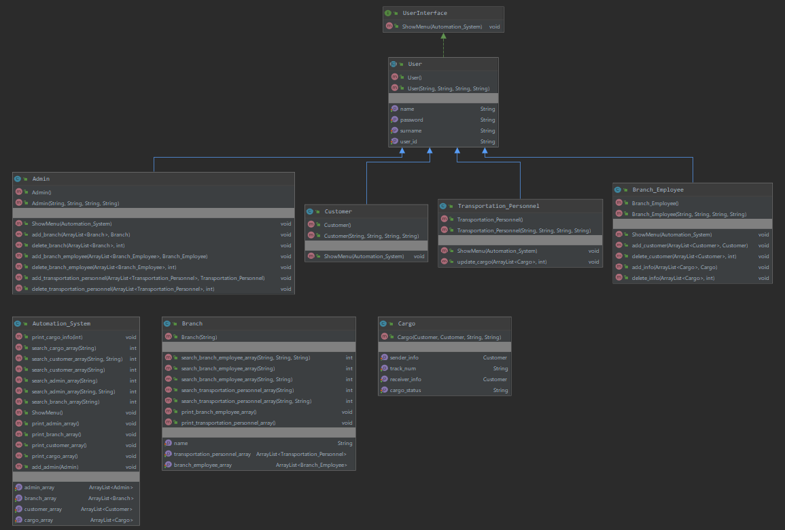
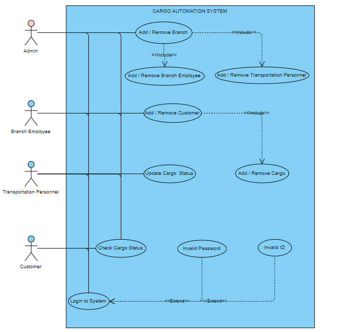
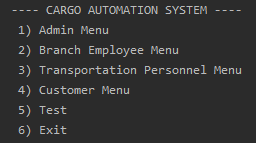
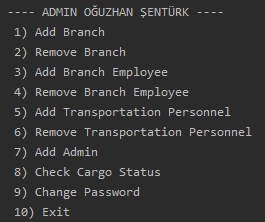
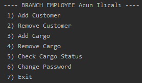
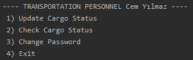
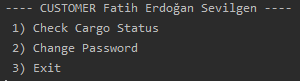

# Cargo-Automation-System

### Description
For this project, I implemented Cargo Automation System in Java.

### Usage

Fitstly, This program is a java program therefore you must install jdk and jre on your system. Then you can compile code with _“javac Main.java”_ command and run this program _“java Main”_ command. This program is Cargo Automation system. We can partion this program into four parts.

*	Admin side
*	Branch Employee side
*	Transportation Personnel side
*	Customer side

#### Admin Side

There is one default admin in program (id :1, password: 123). You must login in to the system default admin account first. After you can add another admin. Admin can add/remove branch in system. Admin can add/remove branch employee and transportation personnel in system after branch is added. Admin can query cargo with tracking number. Admin must enter name, surname, ID and password for the person he/she wants to add. Admin must enter name for the branch he/she wants to add. Admin must enter ID for the person he/she wants to delete. Admin must enter name for the branch he/she wants to delete. Admin can change own password from admin inteface.

#### Branch Employee Side

Branch employee log in to the system with ID and password that admin determined. Branch employee add/remove customer in system. Then branch employee add/remove info about cargo sent from that branch if sender and receiver added the system. Branch employee can query cargo with tracking number. Branch employee must enter name, surname, ID and password for the customer he/she wants to add. Branch employee must enter sender ID, receiver ID and tracking number for the cargo he/she wants to add.
Branch employee must enter ID for the customer he/she wants to delete. Branch employee must enter tracking number for the cargo he/she wants to delete. Branch Employee can change own password from branch employee interface.

#### Transportation Personnel Side

Transportation Personnel log in to the system with ID and password that admin determined.Transportation personnel can update cargo status when cargo delivered. Transportation Personnel can query cargo with tracking number.
Transportation Personnel can change own password from transportation personnel interface.

#### Customer Side

Customer log in to the system with ID and password that admin determined.
Customer can query cargo status by tracking number. Customer can change own password from customer interface.

    
### Class Diagram

### Use Case Diagram

### Screenshots

**Main Menu**

**Admin Menu**

**Branch Employee Menu**

**Transportation Personnel Menu**

**Customer Menu**

### Contact
osenturk@gtu.edu.tr

### License
[Apache License 2.0](https://choosealicense.com/licenses/apache-2.0/)

